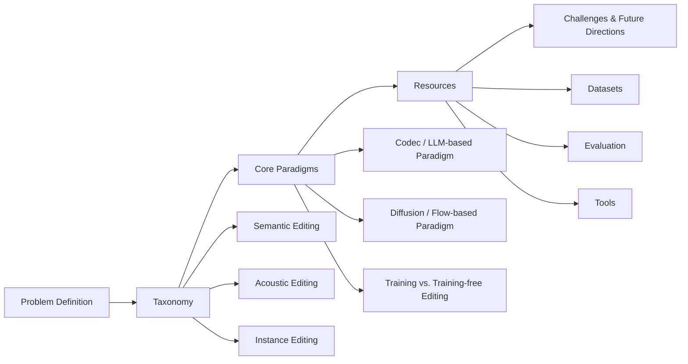
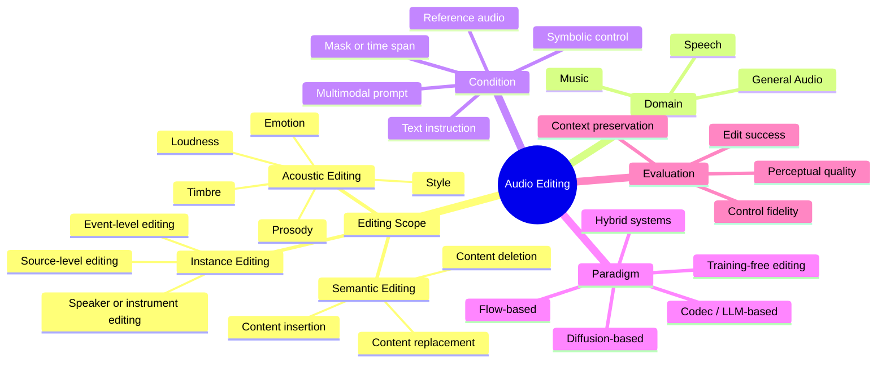

<div align="center">

# AudioEditSurvey

### Foundation-Model Era Audio Editing: A Survey

[](#)
[](#)
[](https://awesome.re)

</div>

---

# Quick Start

1. [Introduction](#introduction)  
2. [Overall](#overall)  
   - [Organization of This Survey](#organization-of-this-survey)  
   - [Taxonomy of Audio Editing](#taxonomy-of-audio-editing)  
   - [Representative Audio Editing Methods](#representative-audio-editing-methods)  
3. [Core Paradigms and Representative Works](#core-paradigms-and-representative-works)  
4. [Resources](#resources)  
   - [Available Datasets](#available-datasets)  
   - [Evaluation Protocols and Benchmarks](#evaluation-protocols-and-benchmarks)  
   - [Data Tools](#data-tools)  
5. [Systemization Challenges and Future Directions](#systemization-challenges-and-future-directions)  
6. [Citation](#citation)

# What's New

- **2026.xx.xx:** We release the initial repository of **AudioEditSurvey**.
- **2026.xx.xx:** The paper and full paper list will be updated soon.

---

## Introduction

This repository maintains the project page and paper list for **AudioEditSurvey: Foundation-Model Era Audio Editing**.

Audio editing is moving from low-level waveform manipulation and expert-designed digital audio workstation operations toward high-level, instruction-driven, and reference-guided generative editing. In the foundation-model era, users can edit speech, music, and general audio through natural language instructions, reference audio, symbolic controls, masks, or temporal regions. This survey aims to provide a systematic overview of recent progress in audio editing, covering task formulation, taxonomy, model architectures, training paradigms, training-free editing strategies, datasets, evaluation protocols, and open challenges.

> **Abstract**  
> Recent foundation models have significantly advanced audio generation and understanding, enabling audio editing systems that can modify speech, music, and general sound according to natural language instructions, reference samples, masks, or other multimodal controls. Compared with traditional signal-processing or DAW-based editing, foundation-model-based audio editing aims to perform semantic, acoustic, and instance-level modifications while preserving non-target content and maintaining perceptual quality. Despite rapid progress, the field remains fragmented across domains, tasks, architectures, training strategies, datasets, and evaluation protocols. This survey reviews representative audio editing methods, organizes them under a unified taxonomy, summarizes core model paradigms and resources, and discusses key challenges toward controllable, faithful, efficient, and general-purpose audio editing.

---

## Overall

### Organization of This Survey



Figure 1: Organization of the survey.

### Taxonomy of Audio Editing

We formulate audio editing as a conditional transformation from an input audio signal to an edited audio signal under user-specified controls. The editing goal is not only to generate the target content, but also to preserve the non-target regions and maintain perceptual consistency.



Figure 2: A high-level taxonomy of audio editing.

### Representative Audio Editing Methods

| Category | Domain | Representative Methods | Main Editing Capability |
|---|---|---|---|
| Text-based speech editing | Speech | EditSpeech, CampNet, FluentEditor, FluentEditor2, A3T | Word-level or utterance-level speech content editing |
| Codec/LLM-based editing | Speech / General | VoiceCraft, SpeechX, AudioLM-style codec models | Token-level generation and editing with context preservation |
| Instruction-based editing | Speech / Music / General | InstructSpeech, InstructME, Instruct-MusicGen, AUDIT | Natural-language instruction following |
| Diffusion-based editing | Music / General | AudioLDM-style editors, AudioEditor, PPAE, AudioMorphix | Latent-space editing, prompt editing, and attention control |
| Flow-based editing | Music / General | MelodyFlow and related flow-matching editors | Efficient continuous audio transformation |
| Training-free editing | Music / General | DDPM/DDIM inversion, attention-control editing, mask-guided editing | Editing without additional task-specific training |

---

## Core Paradigms and Representative Works

### 1. Codec / LLM-based Audio Editing

Codec/LLM-based methods first represent audio as discrete or hierarchical tokens, and then use language-modeling techniques to generate or modify these token sequences. This paradigm is particularly suitable for long-context speech editing, zero-shot voice preservation, and unified audio-language modeling.

Key topics include:

- neural audio codec and token representation;
- semantic vs. acoustic token modeling;
- autoregressive and non-autoregressive token generation;
- context preservation for local editing;
- instruction following with audio-language models.

### 2. Diffusion / Flow-based Audio Editing

Diffusion and flow-based models operate in waveform, spectrogram, or latent spaces and edit audio through denoising, inversion, conditional generation, or continuous transformation. They are widely used in music editing, general audio editing, inpainting, prompt-based manipulation, and training-free editing.

Key topics include:

- latent diffusion for audio editing;
- DDPM/DDIM inversion for real-audio editing;
- mask-guided local generation;
- attention-control and prompt-preserving editing;
- flow matching for efficient audio transformation.

### 3. Training-based and Training-free Editing

Training-based methods learn editing behavior from paired data, synthetic edit pairs, instruction-tuning data, or reference-guided supervision. They often achieve strong task performance but require carefully designed datasets and supervision.

Training-free methods reuse pretrained generative models and modify the sampling, inversion, attention, or masking process at inference time. They are flexible and data-efficient, but often face challenges in precise control, temporal consistency, and non-target preservation.

---

## Resources

### Available Datasets

| Dataset | Domain | Typical Usage |
|---|---|---|
| AudioSet | General Audio | Large-scale sound event modeling and audio-language pretraining |
| FSD50K | General Audio | Sound event classification and general audio resources |
| AudioCaps / Clotho | General Audio | Audio captioning and audio-text alignment |
| VoiceBank + DEMAND | Speech | Speech enhancement, denoising, restoration |
| VCTK / LibriTTS / LJSpeech | Speech | TTS, voice conversion, speech editing |
| MUSDB18 | Music | Source separation and music remixing |
| Slakh2100 | Music | Multi-track music analysis, separation, and editing |
| MedleyDB / FMA / NSynth | Music | Instrument, performance, and music understanding |

### Evaluation Protocols and Benchmarks

Audio editing evaluation should consider three complementary dimensions:

| Dimension | Question | Example Metrics |
|---|---|---|
| Edit Success | Does the edited audio satisfy the instruction? | Human preference, instruction-following score, CLAP similarity, ASR-WER for speech text editing |
| Context Preservation | Are the non-edited regions preserved? | MOS/CMOS, speaker similarity, spectral distance, SDR/SI-SDR, preservation score |
| Control Fidelity | Is the output aligned with the control signal? | Boundary error, pitch/tempo/loudness correlation, event localization accuracy |

Existing audio-language and music understanding benchmarks provide useful references, but a unified benchmark specifically designed for generative audio editing is still needed.

### Data Tools

This repository will gradually maintain links to useful tools for:

- audio preprocessing and segmentation;
- speech recognition and transcription;
- audio captioning and audio-language scoring;
- source separation and remixing;
- subjective listening test templates;
- automatic evaluation scripts for edit success and preservation.

---

## Systemization Challenges and Future Directions

Foundation-model-based audio editing still faces several system-level challenges:

1. **Unified audio representation.**  
   Speech, music, and general audio differ greatly in temporal structure, semantic density, and perceptual attributes. A general audio editing backbone needs representations that can preserve both high-level meaning and fine acoustic details.

2. **Precise and faithful editing.**  
   Editing models must execute the target modification while avoiding unintended changes to speaker identity, musical harmony, background ambience, or non-target events.

3. **Multimodal alignment.**  
   Natural language, reference audio, masks, MIDI, score, and visual inputs provide different types of control signals. Future systems need stronger alignment mechanisms across these modalities.

4. **Long-context and interactive editing.**  
   Real-world audio often involves long recordings, multi-source scenes, and multi-turn user interaction. Robust long-context modeling and iterative correction are crucial for practical systems.

5. **Evaluation and benchmarking.**  
   Current metrics often conflate generation quality with editing quality. The field needs standardized benchmarks that separately measure edit success, context preservation, control fidelity, and perceptual quality.

6. **Safety, copyright, and misuse prevention.**  
   Audio editing systems can be used for voice cloning, impersonation, and unauthorized content manipulation. Watermarking, provenance tracking, and misuse detection are important future directions.

---

## Citation

If you find this survey useful, please consider citing our paper.

```bibtex
@article{audioeditsurvey2026,
  title   = {Foundation-Model Era Audio Editing: A Survey},
  author  = {Anonymous Authors},
  journal = {arXiv preprint},
  year    = {2026}
}
```

---

## Contributing

We welcome issues and pull requests. If you find missing papers, datasets, benchmarks, or tools related to audio editing, please feel free to open an issue or submit a pull request.

## License

This repository is released for academic and research purposes. The license will be updated soon.
